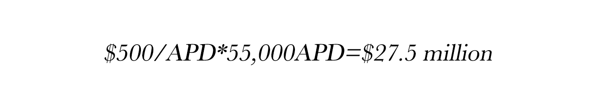
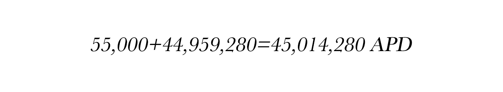
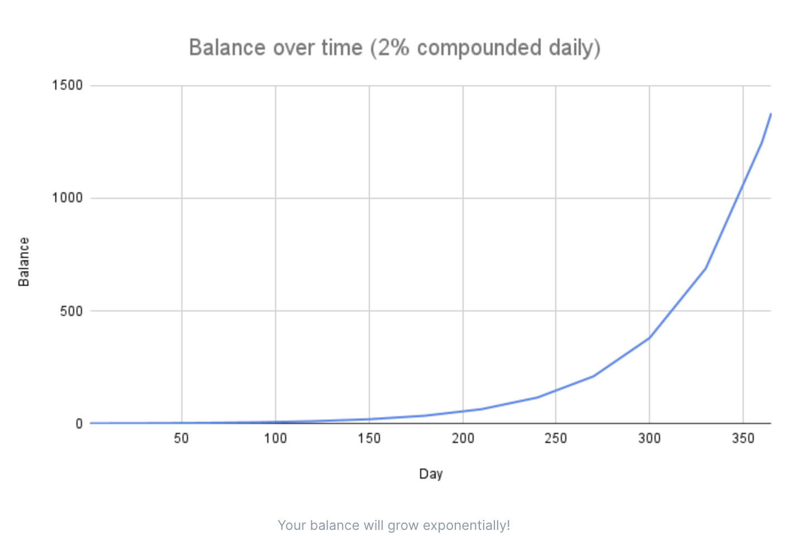
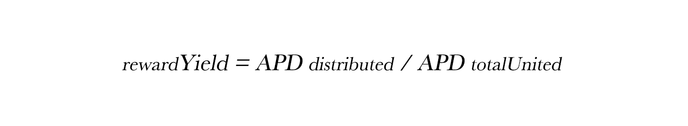

# FAQ

## Why do we need ApeParkDAO in the first place?

* Web3.0 is the destination of traditional game transformation. As a technical service platform, we correspond to the urgent needs of traditional game transformation and bind the interests of both parties.
* The underlying token model derived from the technical service platform incorporates realistic application scenarios and has strong value support.
* The combination of platform service and investment profit with the token mechanism effectively provides the endogenous driving force for the project.

## Is APD a stable coin?

Nope. APD is not a stable coin. APD as a platform token for ApePark DAO, a reserve currency backed by integrated pledged assets, which is focused on supply growth.&#x20;

The price of APD is determined by the assets in its asset basket. Unlike other dual-token models (Stablecoin + Governance Tokens), APD plays the role of two kinds of tokens. The value of APD is stabilized through the Bargain discount mechanism for additional repurchase within the protocol.

## APD is backed , not  pegged.

APD is backed by other decentralized assets, not pegged. Each APD is backed by 1 USDT, not pegged to it. Because the Cave backs every APD with at least 1 USDT, the protocol would buy back and burn APD when it trades below 1 USDT. This has the effect of pushing APD price back up to 1 USDT. APD could always trade above 1 USDT because there is no upper limit imposed by the protocol. You might say that the floor price or intrinsic value of APD is 1 USDT. We believe that the actual APD value will always be 1 USDT + premium, but in the end that is up to the market to decide.

## How does it work?

In general, APD is controlled by its protocol-managed Cave, Protocol Owned Liquidity (POL), Bargain, and Unity to control the supply relationship.

Bargain sales generate profits for the protocol, and the Cave uses the profit to mint APD and distribute them to all participants. With Bargain, the protocol is able to accumulate its own liquidity.

## Why is PCV important?

As the protocol controls the funds in its Cave, APD can only be minted or burned by the protocol. This also guarantees that the protocol can always back 1 APD with 1 USDT. You can easily define the risk of your investment because you can be confident that the protocol will indefinitely buy APD below 1 USDT with the Cave assets until no one is left to sell.

As the protocol accumulates more PCV, a longer runway is guaranteed for the Unity participants. This means the Unity participants can be confident that the current Unity APY can be sustained for a longer term because more funds are available in the Cave.

## Why is POL important?

APD owns most of its liquidity thanks to its Bargain mechanism. This has several benefits:

* APD does not have to pay out high farming rewards to incentivize liquidity providers a.k.a renting liquidity.&#x20;
* APD guarantees the market that the liquidity is always there to facilitate sell or buy transactions.
* By being the largest LP (liquidity provider), it earns most of the LP fees which represents another source of income to the Cave.
* All POL can be used to back APD. The LP tokens are marked down to their risk-free value for this purpose.

## What will happen if there is a bank run on APD?

Fractional reserve banking works because depositors don’t withdraw their funds all at once. A depositor’s faith in the banking system rests on regulations and agencies like Federal Deposit Insurance Corporation (FDIC). APD does not have FDIC insurance, but it has an incentive structure that protects participants. Let’s take a look at how it performs during a hypothetical bank run. In this scenario, we assume the majority of Unity participants would panic and cancel Unity their tokens from APD - the Unity percentage which stands at 92% now quickly collapses to 3.3%, leaving only 55,000 APD Unity. Next, we assume the Risk-Free Value (RFV) inflows to the Cave completely dry up. For context, RFV is currently growing at about $1 million every 2 days. However, during a bank run this growth will likely stop.

Finally, we assume that those last standing Unity participants bought in at a price of $500 per APD. The initial investment of these Unity participants would be:

Let's suppose, the total APD supply is 2,082,553 and the RFV is $47,041,833. Remember that 1 APD is backed by 1 USD (USDT). By subtracting these two numbers, we know 44,959,280 APD will eventually get issued to the remaining Unity participants. In roughly a year, these Unity participants who are holding 55,000 APD will have:

$27.5 million investment made by these Unity participants will turn into about $45 million based on cash flow alone if they stay Unity (recall that 1 APD is backed by 1 USD). In this bank run scenario, the Unity participants who stay Unity not only get their money back, but also make some profit. Therefore, it isn’t just a normal DeFi, it is actually a dominant strategy.

The above scenario is unlikely to play out because when other people find out that extremely high rewards are being paid to the Unity participants, they will copy the strategy by buying and joining Unity.

## Why is the market price of APD so volatile?

When the various mechanisms of ApeParkDAO work together, it can cause considerable volatility. APD is likely to trade at a very high price as the market is ready to pay a hefty premium to capture a percentage of the current market capitalization. However, if market sentiment turns bearish, the price of APD could also drop to a large degree. We would expect significant APD volatility during our growth phase, so do your own research on whether this project suits your goals.

## What is the point of buying it now when APD trades at a very high premium？

When you buy and Unity APD, you capture a percentage of the supply (market cap) which will remain close to a constant. This is because your Unity APD balance also increases along with the circulating supply. The implication is that if you buy APD when the market cap is low, you would be capturing a larger percentage of the market cap.

## What is a rebase?

Rebase is a mechanism by which your Unity APD balance increases automatically. When new APD are minted by the protocol, a large portion of it goes to the Unity participants. The protocol utilizes the rebase mechanism to increase the Unity APD balance so that 1 Unity APD is always redeemable for 1 APD.

## What is reward yield？

Reward yield is the percentage by which your Unity APD balance increases on the next epoch. It is also known as rebase rate. You can find this number on the APD Unity page.

## What is APY？

APY stands for annual percentage yield. It measures the real rate of return on your principal by taking into account the effect of compounding interest. In the case of ApeParkDAO, your Unity APD represents your principal, and the compound interest is added periodically on every epoch (36,000 Binance Smart Chain, or around 8 hours) thanks to the rebase mechanism.

## How is the APY calculated？

The APY is calculated from the reward yield (a.k.a rebase rate) using the following equation:

It raises to the power of 1095 because a rebase happens 3 times daily. Consider there are 365 days in a year, this would give a rebase frequency of 365 \* 3 = 1095. Reward yield is determined by the following equation:

The number of APD distributed to the Unity contract is calculated from APD total supply using the following equation:

Note that the reward rate is subject to change by the protocol.

## Why does the price of APD become irrelevant in long term?

As illustrated above, your APD balance will grow exponentially over time thanks to the power of compounding. Let's say you buy an APD for $400 now and the market decides that in 1 year time, the intrinsic value of APD will be $2. Assuming a daily compound interest rate of 2%, your balance would grow to about 1377 APDs by the end of the year, which is worth around $2754. That is a cool $2354 profit! By now, you should understand that you are paying a premium for APD now in exchange for a long-term benefit. Thus, you should have a long time horizon to allow your APD balance to grow exponentially and make this a worthwhile investment.

## What will be APD's intrinsic value in the future？

There is no clear answer for this, but the intrinsic value can be determined by the Cave performance. For example, if the Cave could guarantee to back every APD with 100 USDT, the intrinsic value will be 100 USDT. It can also be decided by the DAO. For example, if the DAO decides to raise the price floor of APD, its intrinsic value will rise accordingly.

## How does the protocol manage to maintain the high Unity APY？

Let’s say the protocol targets an APY range of 1,000% to 10,000%, this would translate to a minimum reward yield of about 0.2105%, or a daily growth of about 0.6328%. Please refer to the equation above to learn how APY is calculated from the reward yield. If there are 100,000 of APD Unity right now, the protocol would need to mint an additional 632.8 APD to achieve this daily growth. This is achievable if the protocol can bring in at least $632.80 of daily revenue from Bargain sales. Even if the protocol doesn't bring in that much revenue, it can still sustain 1,000% APY for a considerable amount of time due to the excess reserve in the Cave.

## Do I have to join or cancel Unity APD on every epoch to get my rebase rewards?

No. Once you have Unity APD with ApeParkDAO, your Unity APD balance will auto-compound on every epoch. That increase in balance represents your rebase rewards.

## How do I track my rebase rewards？

You can track your rebase rewards by calculating the increase in your Unity APD balance.

* Record down the Current Index value on the Unity page when you first Unity your APD. Let's call this the Start Index.
* After Unity for some time, if you want to determine by how much your balance has increased, check the Current Index value again. Let's call this the End Index.
* By dividing the End Index by Start Index, you would get the ratio by which your Unity APD balance has increased.

In this example, the APD balance has grown by 1.5 times.

