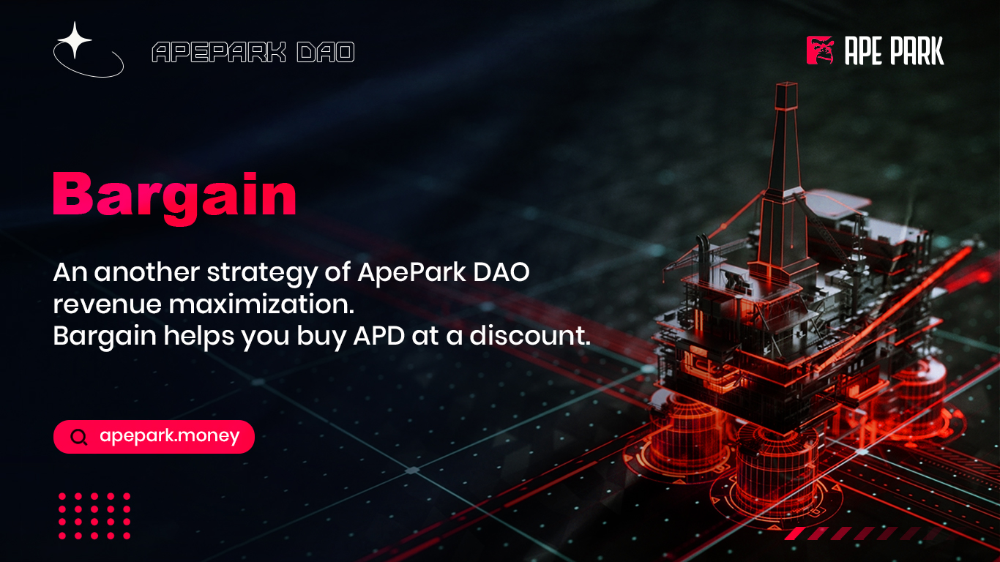

# Bargain

## What is Bargain?

Bargain is the second strategy of ApeParkDAO revenue maximization. Selling Bargain through Bargain to obtain the liquidity and other reserve assets owned by the protocol itself. The agreement announces quotations and terms to Bargain users, such as Bargain price, how many APDs can be purchased by Bargain users and the period of the award. Before the award period expires, Bargain users can claim some of the reward (APD tokens) first, and then they can claim the full amount when it expires.

Bargain is a proactive and short-term strategy. The price discovery mechanism of Bargain's secondary market makes unpredictable Bargain's discounts. Therefore, the purchase of Bargain is seen as a more proactive investment strategy, requiring investors to continuously monitor Bargain discounts to gain more profits than Unity.

Bargain sales allow ApeParkDAO to accumulate liquidity owned by the agreement itself. We call the agreement liquidity POL. More POLs ensure that sufficient funds are always locked in Cave, which is used in transaction pools to facilitate market operations and protect token holders. ApeParkDAO has its marketplace that not only gives investors additional protection but also agreements to accumulate more revenue from liquidity provider rewards (LP rewards) to support the Cave.

