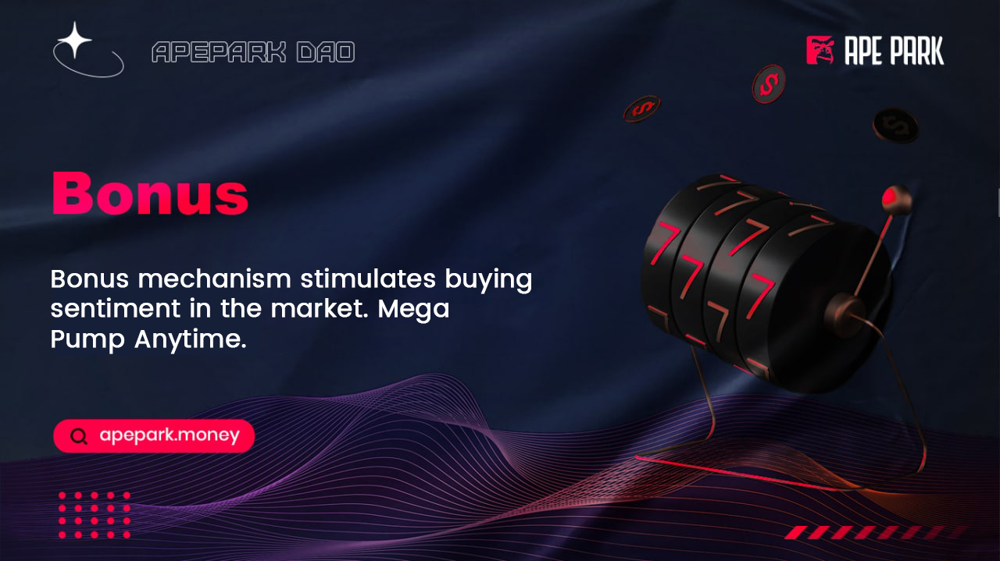

# Bonus

## What is Bonus?

Bonus is as an extra allowance.ApeParkDAO uses the Bonus mechanism to stimulate buying sentiment in the market, increase and activate potential users. If the contract accumulates 10 addresses and the purchase amount of each address is more than 1000USDT, the bonus will be weighted average for users who purchase more than 1000USDT.

