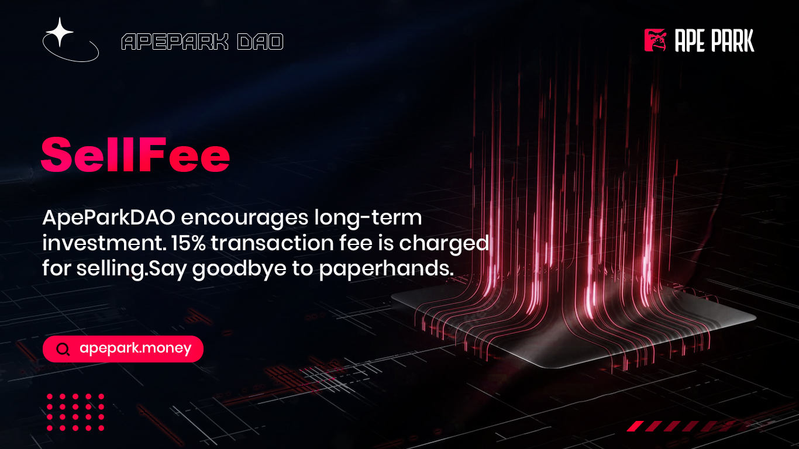

# 🪙 SellFee

## What is SellFee?

ApeParkDAO seeks to encourage long-term investment rather than short-term trading. Therefore, a 15% transaction fee is charged for selling APDs. SellFee mechanism is also designed to ensure that APD prices are stable, which ApeParkDAO wants to reduce by suppressing sales.
