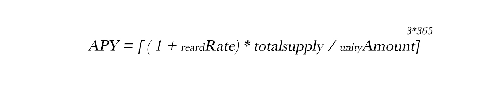

# Equations

## Unity

The swap between APD and uAPD is always cashed out at 1:1.

.jpg>)

The reserve will not require the return of uAPD when depositing profits, which will cause an imbalance. The rebase uAPD is to correct the imbalance between the outstanding deposits of APD and uAPD. This rebase allows the outstanding return of uAPD to ensure that uAPD is equal to a APD.

According to the reward rate of return tells you the annualized rate of return. It takes into account the effect of compound interest, because uAPD rebases exponentially.

Measure the dollar value of all APDs in the ApeParkDAO protocol.

## Bargain

The Bargain price is determined by the value of the SLP and the number of outstanding Bargains. The agreement considers APD and $USDT to be equal, because the agreement measures APD by its intrinsic value. This means that we only need to care about the sum of the assets in the pool, not their value. According to the constant product formula x\*y = k, the risk-free value is the minimum value of x + y. This happens to be when x = y. We can use the square root of x and y to determine this.

The debt ratio is the sum of all APD Bargains committed divided by the total supply of APD. This allows us to measure the debt of the system.

Premium is derived from the system’s debt ratio and ratio variables. This scaling variable allows us to control the rate of increase in Bargain prices. Premium determines the income of the agreement, which in turn determines the rights and interests of the Bargain purchaser. The LP collected at the premium is used to forge a new APD and distribute it to the Bargain purchaser and DAO.

## Sell

If the last market price is greater than TWAP, the sales contract will execute the order at the last market price minus the discount controlled by DAO, thereby providing arbitrage to encourage liquidity.

## Dashboard

Backing per APD

Every APD in circulation is backed by the Cave. The assets in the Cave can be divided into two categories: stablecoin and non-stablecoin.

How the protocol’s liquidity is calculated:

